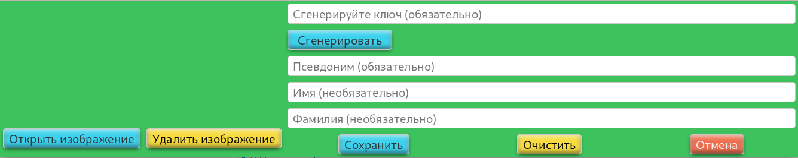
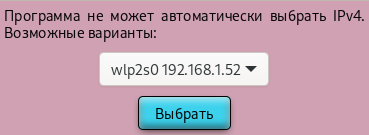
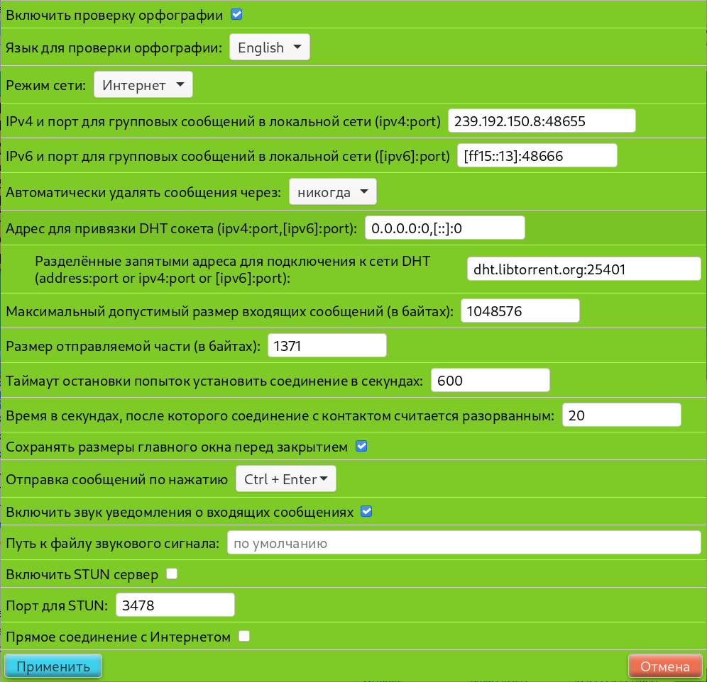

# Коммунист

Коммунист - программа передачи сообщений устройство-устройство.

## Описание

Коммунист  - простая программа передачи сообщений устройство-устройство. Программа написана на С++, графическая часть базируется на библиотеке GTK 4. Для установления прямого соединения между пользователями используется техника UDP hole punch и DHT. Программа может работать в двух режимах: локальная сеть и интернет, поддерживаются протоколы IPv4 и IPv6. В настоящий момент возможна отправка и получения двух типов сообщений: текстовые сообщения и файлы. Все сообщения хранятся локально в зашифрованном виде и передаются также в зашифрованном виде (используется стандарт шифрования AES в сочетании с ed25519, см. исходный код).

## Установка

### Linux

`git clone https://github.com/ProfessorNavigator/communist.git`\
`cd communist`\
`meson -Dbuildtype=release build`\
`cd build`\
`ninja install`

Для выполнения последней команды вам скорее всего будут нужны права суперпользователя. 

### Windows

Вы можете установить Коммунист, собрав его из исходных текстов. Для этого лучше использовать проект MSYS2 [https://www.msys2.org/](https://www.msys2.org/). Выполните инструкции по установке с сайта MSYS2, установите зависимости указанные в секции [Зависимости](#зависимости) и git (все пакеты должны быть для mingw64). Затем создайте папку, куда вы будете загружать исходный код (путь должен содержать только латинские буквы и не должен содержать пробелов). Затем откройте консоль mingw64 и выполните указанные ниже команды (в образце исходный код загружается в C:\Communist).
 
`cd /c/Communist`\
`git clone https://github.com/ProfessorNavigator/communist.git`\
`cd communist`\
`meson -Dbuildtype=release build`\
`cd build`\
`ninja install`

Если всё прошло успешно, то в папке `путь_к_msys2/mingw64/bin` появится исполняемый файл communist.exe. 

## Зависимости

Коммунист использует meson для сборки и установки из исходных текстов. Установите его, а также ninja и git.\
Вам также потребуются [gtkmm-4.0](http://www.gtkmm.org/), [libzip](https://libzip.org/), [icu](https://icu.unicode.org/) (версия >= 69), [libgcrypt](https://www.gnupg.org/software/libgcrypt/index.html), [libtorrent-rasterbar](https://www.libtorrent.org/), [hunspell](https://github.com/hunspell/hunspell). Для сборки программы все библиотеки должны иметь заголовочные файлы, т.е., если вы используете например Debian Linux, то вам потребуются ...-devel версии пакетов.

Вам также может потребоваться установить Good plugins для gstreamer - они используются для воспроизведения звуковых сигналов, установленных по умолчанию.

## Использование

- Сразу после запуска программа предложит вам создать пользователя.\
		\
		Имя пользователя и пароль могут быть любыми, однако рекомендуется сделать их максимально надёжными - они используются для шифрования данных пользователя, хранящихся на диске.
- Следующи шаг - создание профиля.\
		\
		Если вы хотите добавить аватар - нажмите "Открыть изображение" (поддерживаемые форматы зависят от установленной версии GDK Pixbuf и от его настроек).

- Последний шаг - добавление контактов. Нажмите "Добавить контакт" и введите ключ вашего собеседника (для этого вам придётся сначала обменяться ключами, например посредством электронной почты, хотя автор крайне рекомендует производить данную операцию при личной встрече и без помощи электронных устройств)\
		\
		Ваш публичный ключ можно узнать, нажав `Инструменты->Узнать свой ключ`.

Если программа не сможет самостоятельно определить используемый сетевой интерфейс, то вы увидите окно с предложением сделать соответствующий выбор вручную. Это может произойти, если компьютер подключён сразу к нескольким сетям. 

В этом случае выберите нужный интерфейс и нажмите "Выбрать".

## Настройки

### Меню настроек

В программе имеется возможность настраивать различные параметры (меню настроек находится в `Инструменты->Общие настройки`)

Если всё работает нормально, то вам скорее всего нет необходимости что-либо менять. В противном случае...

Проверка орфографии осуществляется с помощь библиотеки libhunspell. Вы можете отключить или включить данную функцию, а также выбрать используемый язык. В данный момент доступны только два варианта словарей: английский и русский. Если вам требуются другие варианты - свяжитесь с автором (с помощью e-mail, указанного ниже или через любую платформу, через которую вы загрузили исходный код, языки для связи: русский и английский). Язык интерфейса программы можно изменить с помощью переменной `LANG`. Варианты переводов те же: английский и русский. По умолчанию используется английский, переключение на русский может быть осуществлено установкой переменной `LANG=ru_RU` (если у вас настроена соответствующая системная локаль, то это произойдёт автоматически). Для желающих помочь с переводом программы в репозитории находится файл `Communist.pot` (в программе используется GNU gettext). Для получения дальнейших инструкций по внедрению вашего перевода свяжитесь с автором.
 
Настройка `Режим сети` имеет два доступных варианта: Интернет и Локальная. В режиме "Интернет" программа будет пытаться установить прямую связь с контактами из списка с помощью DHT (используется вариант реализации из [libtorrent-rasterbar](https://www.libtorrent.org/)). В режиме "Локальная" DHT отключается, вместо этого рассылаются групповые UDP запросы. Следующие две строки в меню указывают, какие адреса и порты будут для этого использованы (они должны совпадать на всех устройствах, с которыми вы пытаетесь установить связь). 
 
Автоматическое удаление сообщений нужно для экономии памяти - все полученные и отправленные сообщения хранятся на жёстком диске. Удаление старых сообщений осуществляется при старте программы. Вы также можете удалять сообщения по одному вручную - для этого есть соответствующи пункт в контекстном меню каждого сообщения.
 
`Адрес для привязки DHT сокета` - одна из настроек libtorrent, указывающая пары ip:port, к которым будет осуществлена привязка сокета DHT. Нулевые значения означают "по умолчанию". Если вы имеете прямой доступ в интернет (т.н. "белый" ip адрес), то по возможности измените их и опубликуйте где-либо в открытом доступе - это поможет другим пользователям подключаться к сети DHT.
 
`... адреса для подключения к сети DHT` - адреса для подключения к DHT при первом запуске или при отсутствии кэш-файла. Если всё прошло успешно, то в дальнейшем программа будет сохранять состояние сети DHT в кэш-файле (~/.cache/Communist/dhtstate в Linux и C:\Users\\'user'\\.cache\Communist\dhtstate в Windows), и использовать для подключения кэшированные адреса.
 
`Максимально допустимый размер сообщения...` - настройка ограничивает максимальный размер входящего сообщения. Если он будет превышен, то сообщение не будет принято. Это сделано, чтобы избежать возможных атак. Вы можете установить любое значение, которое считаете безопасным.
 
`Размер отправляемой части...` - сообщения отправляются по частям с проверкой хэша каждой части на стороне получателя. Данный параметр указывает размер такой части. Не рекомендуется устанавливать слишком маленькое значение - возрастёт технический сетевой траффик. В то же время не рекомендуется устанавливать слишком большое значение - в случае возникновения ошибки программа попытается отправить часть снова, т.е. сетевой траффик также возрастёт. 
 
`Таймаут остановки...` - параметр указывает количество секунд, по истечении которого контакт будет считаться отключённым от сети. После этого попытки установить соединение будут прекращены до получения нового значения пары адрес:порт из сети DHT.
 
`...соединение с контактом считается разорванным` - параметр, устанавливающий паузу, после которой соединение с контактом будет считаться разорванным.
 
`Отправка сообщения по...` - комбинация клавиш для отправки сообщения. Доступны два варианта: Ctrl + Enter и Enter.
 
 `Включить звук...` - при получении сообщения будет воспроизводиться звуковой сигнал. 
 
`Путь к файлу звукового сигнала` - пустая строка - значение по умолчанию. Вы можете установить свой вариант звукового сигнал, для этого укажите полный путь к соответствующему файлу.

`Включить STUN сервер` включает локальный STUN  сервер (не соответствует требованиям RFC, только для использования в сети Коммунист). Включите его, если имеете прямой доступ в Интернет.
 
`Порт для STUN` - порт, для использования в STUN сервере и для соответствующих запросов. Должен быть одинаковым для всех машин в одной и той же оверлейной сети.
 
`Прямое соединение с Интернетом` - включите, если имеете таковое. Данная опция отключает отправку запросов к STUN серверам.
 
Предупреждение! После нажатия "Применить" программа будет закрыта. Настройки вступят в силу при следующем запуске.
 
### Список STUN серверов
 
 Для определения "внешнего" ip адреса программа отправляет запросы на STUN серверы. Адреса некоторых из них уже имеются в файле ../share/Communist/StunList. Но вам может потребоваться изменить их. Адрес каждого нового сервера должен помещаться в отдельной строке и должен включать в себя ip адрес и порт или "буквенный" адрес и порт (см. файл ../share/Communist/StunList в качестве образца). Если вы помещаете адреса серверов в "буквенной" форме, то программе потребуется сначала отправить DNS запрос, поэтому подключение к сети может занять некоторое время.

### Внешний вид
 
Для изменения внешнего вида окна программы отредактируйте файл ../share/Communist/mainWindow.css (см. исходный код и [https://docs.gtk.org/gtk4/css-properties.html](), чтобы узнать детали).

## Планы
 
Автор хотел бы добавить больше типов передаваемых сообщений: голосовые и видео, а также прямые видео и аудио звонки. Но к сожалению он не особенно разбирается в соответствующих библиотеках, поэтому это может занять некоторое время. Также хотелось бы добавить функционал групповых чатов и каналов, однако из-за особенностей передачи информации по протоколу IPv4 (NAT) - это скорее всего будет реализовано только для IPv6 сетей (если у вас есть какие-либо идеи и предложения, пожалуйста свяжитесь с автором любым доступным способом). 

## Лицензия

GPLv3+ (см. `COPYING`).

## Помощь

Если вы хотите помочь в развитии проекта, то можете оказать [материальную](https://yoomoney.ru/to/4100117795409573) поддержку. Или помочь в развитии кодовой базы (свяжитесь с автором для получения доступа к репозиториям).

## Контакты для связи

Вы можете связаться с автором по e-mail \
bobilev_yury@mail.ru